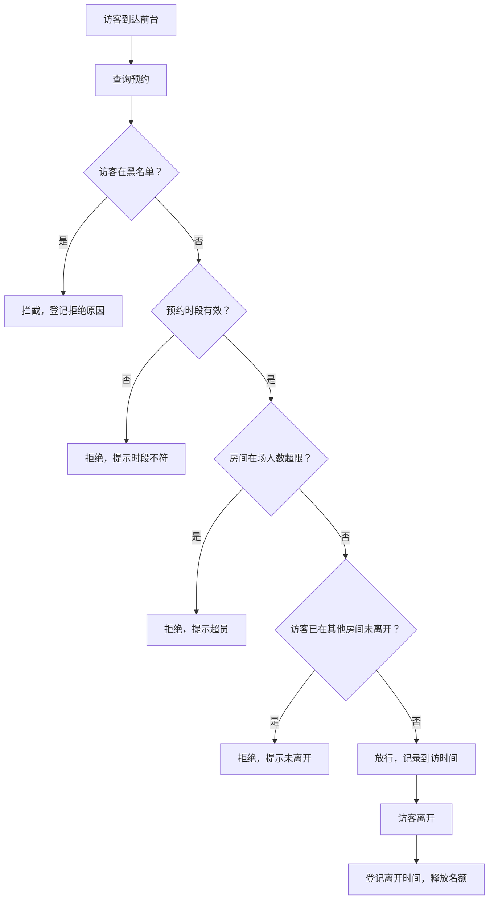

## 1. 产品概述

月子中心探视时段放行与黑名单拦截系统，用于管理月子中心住户的探视全流程，包括预约、核验、放行、离开登记，并强制执行探视人数上限和黑名单拦截规则，保障住客安宁与安全。目标用户为月子中心前台人员和管理员。

## 2. 核心功能

### 2.1 用户角色

| 角色 | 登录方式 | 核心权限 |
|------|----------|----------|
| 管理员 | 账号密码登录 | 全部功能，含楼层房间管理、住户档案、黑名单管理、统计面板 |
| 前台人员 | 账号密码登录 | 探视预约、前台核验、到访放行、离开登记、超员查看 |

### 2.2 功能模块

1. **登录页**：账号密码登录，角色区分
2. **楼层房间管理**：楼层列表、房间CRUD，房间字段含编号、所属楼层、房型、入住状态、最大探视人数
3. **住户档案**：住户信息管理，关联房间
4. **探视预约**：创建/查看/取消预约，预约字段含预约编号、住户姓名、访客姓名、关系、预约时段
5. **前台核验**：按预约编号或访客姓名查询预约，展示预约详情，核验身份
6. **到访放行**：放行确认（记录到访时间），若黑名单则拦截并登记拒绝原因；同一房间同一时段在场访客不得超过上限；同一访客离开前不可再次进入其他房间
7. **离开登记**：记录离开时间，释放探视名额
8. **黑名单管理**：添加/移除黑名单访客，黑名单访客禁止创建预约且不可现场放行
9. **探视统计面板**：房间探视热度、拦截次数、超员预警分布

### 2.3 页面详情

| 页面名称 | 模块名称 | 功能描述 |
|----------|----------|----------|
| 登录页 | 登录表单 | 账号密码输入，角色校验，登录跳转 |
| 仪表盘 | 统计概览 | 今日探视数、在场访客数、拦截次数、超员预警数 |
| 楼层房间管理 | 楼层列表 | 楼层增删改查 |
| 楼层房间管理 | 房间列表 | 房间增删改查，含编号、楼层、房型、入住状态、最大探视人数 |
| 住户档案 | 住户列表 | 住户增删改查，关联房间 |
| 探视预约 | 预约列表 | 预约增删改查，展示预约编号、住户、访客、关系、时段 |
| 前台核验 | 核验查询 | 按预约编号/访客姓名搜索，展示预约详情 |
| 到访放行 | 放行操作 | 放行确认/拦截拒绝，记录到访时间，拒绝原因登记 |
| 离开登记 | 离开操作 | 记录离开时间，释放名额 |
| 黑名单管理 | 黑名单列表 | 黑名单增删查，展示访客姓名、身份证号、加入原因、加入时间 |
| 探视统计 | 统计面板 | 房间探视热度图表、拦截次数统计、超员预警分布 |

## 3. 核心流程

### 3.1 探视放行主流程

1. 访客到达前台，前台人员查询预约
2. 系统校验：访客是否在黑名单 → 预约时段是否有效 → 房间在场人数是否超限 → 访客是否已在其他房间未离开
3. 校验通过 → 放行，记录到访时间
4. 校验不通过 → 拦截，记录拒绝原因
5. 访客离开 → 登记离开时间，释放名额

### 3.2 流程图

## 4. 用户界面设计

### 4.1 设计风格

- **主色调**：温暖柔和的粉色系（#E8A0BF）搭配暖白背景（#FFF8F0），传递月子中心的温馨感
- **辅助色**：深灰（#2D3436）用于文字，浅粉（#F8D7E4）用于卡片背景
- **警告/拦截色**：红色系（#E74C3C）用于拦截和超员提示
- **成功/放行色**：绿色系（#27AE60）用于放行确认
- **按钮风格**：圆角（8px），柔和阴影，hover时轻微上浮
- **字体**：思源黑体 / Noto Sans SC，标题18-24px，正文14px
- **布局风格**：左侧导航栏 + 右侧内容区，卡片式布局
- **图标风格**：线性图标，与PrimeVue Icons一致

### 4.2 页面设计概览

| 页面名称 | 模块名称 | UI元素 |
|----------|----------|--------|
| 登录页 | 登录表单 | 居中卡片，品牌Logo，输入框，登录按钮 |
| 仪表盘 | 统计概览 | 4个统计卡片，下方图表区域 |
| 楼层房间管理 | 楼层列表 | 左侧楼层Tab，右侧房间卡片网格 |
| 楼层房间管理 | 房间编辑 | 对话框表单，含编号、楼层、房型、入住状态、最大探视人数 |
| 住户档案 | 住户列表 | 数据表格，支持搜索和筛选 |
| 探视预约 | 预约列表 | 数据表格，时段列高亮，新建预约对话框 |
| 前台核验 | 核验查询 | 搜索栏 + 预约详情卡片 |
| 到访放行 | 放行操作 | 预约详情 + 放行/拦截按钮，拦截时弹出原因输入框 |
| 离开登记 | 离开操作 | 在场访客列表，点击确认离开 |
| 黑名单管理 | 黑名单列表 | 数据表格，添加/移除操作 |
| 探视统计 | 统计面板 | 饼图、柱状图、折线图，PrimeVue Chart组件 |

### 4.3 响应式设计

- 桌面优先，最小支持1280px宽度
- 侧边栏可折叠
- 数据表格在小屏幕下横向滚动
