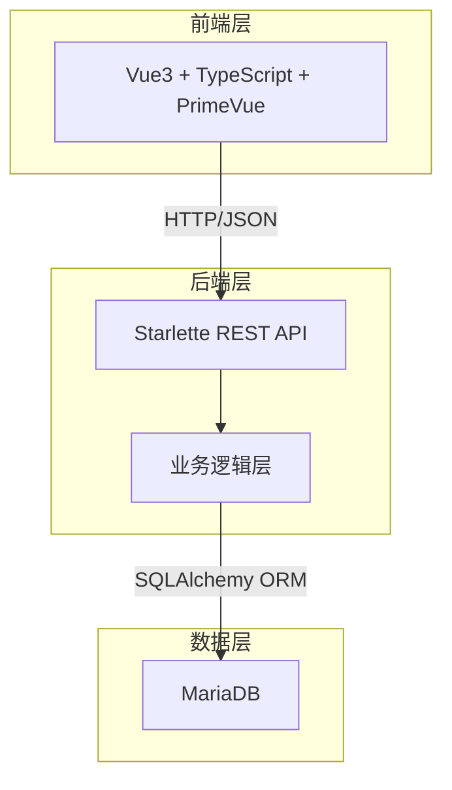
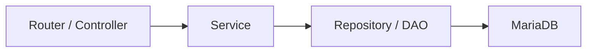
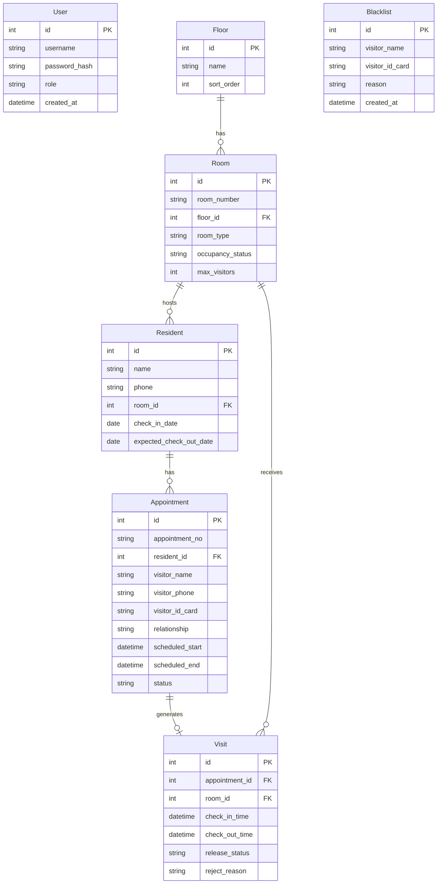

## 1. 架构设计



## 2. 技术说明

- **前端**：Vue3 + TypeScript + PrimeVue + Vite + Vue Router + Pinia
- **后端**：Python 3.11+ + Starlette + SQLAlchemy 2.0 (异步) + Alembic
- **数据库**：MariaDB 10.6+
- **认证**：JWT (PyJWT)，Bearer Token
- **前后端分离**：前端 Vite 开发服务器代理后端 API

## 3. 路由定义

| 路由 | 用途 |
|------|------|
| `/login` | 登录页 |
| `/` | 仪表盘（统计概览） |
| `/rooms` | 楼层房间管理 |
| `/residents` | 住户档案 |
| `/appointments` | 探视预约 |
| `/checkin` | 前台核验与到访放行 |
| `/checkout` | 离开登记 |
| `/blacklist` | 黑名单管理 |
| `/statistics` | 探视统计面板 |

## 4. API 定义

### 4.1 认证

| 方法 | 路径 | 说明 |
|------|------|------|
| POST | `/api/auth/login` | 登录，返回JWT |
| GET | `/api/auth/me` | 获取当前用户信息 |

### 4.2 楼层房间

| 方法 | 路径 | 说明 |
|------|------|------|
| GET | `/api/floors` | 获取楼层列表 |
| POST | `/api/floors` | 创建楼层 |
| PUT | `/api/floors/{id}` | 更新楼层 |
| DELETE | `/api/floors/{id}` | 删除楼层 |
| GET | `/api/rooms` | 获取房间列表（支持楼层筛选） |
| POST | `/api/rooms` | 创建房间 |
| PUT | `/api/rooms/{id}` | 更新房间 |
| DELETE | `/api/rooms/{id}` | 删除房间 |

### 4.3 住户档案

| 方法 | 路径 | 说明 |
|------|------|------|
| GET | `/api/residents` | 获取住户列表 |
| POST | `/api/residents` | 创建住户 |
| PUT | `/api/residents/{id}` | 更新住户 |
| DELETE | `/api/residents/{id}` | 删除住户 |

### 4.4 探视预约

| 方法 | 路径 | 说明 |
|------|------|------|
| GET | `/api/appointments` | 获取预约列表 |
| POST | `/api/appointments` | 创建预约（含黑名单校验） |
| PUT | `/api/appointments/{id}` | 更新预约 |
| DELETE | `/api/appointments/{id}` | 取消预约 |

### 4.5 到访放行

| 方法 | 路径 | 说明 |
|------|------|------|
| GET | `/api/appointments/search` | 按编号/访客姓名搜索预约 |
| POST | `/api/visits/checkin` | 到访放行（含黑名单、时段、超员、重复进入校验） |
| POST | `/api/visits/checkout` | 离开登记 |

### 4.6 黑名单

| 方法 | 路径 | 说明 |
|------|------|------|
| GET | `/api/blacklist` | 获取黑名单列表 |
| POST | `/api/blacklist` | 添加黑名单 |
| DELETE | `/api/blacklist/{id}` | 移除黑名单 |

### 4.7 统计

| 方法 | 路径 | 说明 |
|------|------|------|
| GET | `/api/statistics/dashboard` | 仪表盘概览数据 |
| GET | `/api/statistics/room-heat` | 房间探视热度 |
| GET | `/api/statistics/interception` | 拦截次数统计 |
| GET | `/api/statistics/overcapacity` | 超员预警分布 |

## 5. 服务端架构图



## 6. 数据模型

### 6.1 数据模型定义



### 6.2 数据定义语言

```sql
CREATE TABLE user (
    id INT AUTO_INCREMENT PRIMARY KEY,
    username VARCHAR(50) NOT NULL UNIQUE,
    password_hash VARCHAR(255) NOT NULL,
    role ENUM('admin', 'receptionist') NOT NULL DEFAULT 'receptionist',
    created_at DATETIME NOT NULL DEFAULT CURRENT_TIMESTAMP
);

CREATE TABLE floor (
    id INT AUTO_INCREMENT PRIMARY KEY,
    name VARCHAR(50) NOT NULL,
    sort_order INT NOT NULL DEFAULT 0
);

CREATE TABLE room (
    id INT AUTO_INCREMENT PRIMARY KEY,
    room_number VARCHAR(20) NOT NULL UNIQUE,
    floor_id INT NOT NULL,
    room_type ENUM('single', 'double', 'suite', 'vip') NOT NULL DEFAULT 'single',
    occupancy_status ENUM('vacant', 'occupied', 'maintenance') NOT NULL DEFAULT 'vacant',
    max_visitors INT NOT NULL DEFAULT 2,
    FOREIGN KEY (floor_id) REFERENCES floor(id) ON DELETE RESTRICT
);

CREATE TABLE resident (
    id INT AUTO_INCREMENT PRIMARY KEY,
    name VARCHAR(100) NOT NULL,
    phone VARCHAR(20),
    room_id INT NOT NULL,
    check_in_date DATE NOT NULL,
    expected_check_out_date DATE,
    FOREIGN KEY (room_id) REFERENCES room(id) ON DELETE RESTRICT
);

CREATE TABLE blacklist (
    id INT AUTO_INCREMENT PRIMARY KEY,
    visitor_name VARCHAR(100) NOT NULL,
    visitor_id_card VARCHAR(30) NOT NULL UNIQUE,
    reason TEXT NOT NULL,
    created_at DATETIME NOT NULL DEFAULT CURRENT_TIMESTAMP
);

CREATE TABLE appointment (
    id INT AUTO_INCREMENT PRIMARY KEY,
    appointment_no VARCHAR(30) NOT NULL UNIQUE,
    resident_id INT NOT NULL,
    visitor_name VARCHAR(100) NOT NULL,
    visitor_phone VARCHAR(20),
    visitor_id_card VARCHAR(30),
    relationship VARCHAR(30) NOT NULL,
    scheduled_start DATETIME NOT NULL,
    scheduled_end DATETIME NOT NULL,
    status ENUM('pending', 'checked_in', 'checked_out', 'cancelled', 'rejected') NOT NULL DEFAULT 'pending',
    FOREIGN KEY (resident_id) REFERENCES resident(id) ON DELETE RESTRICT
);

CREATE TABLE visit (
    id INT AUTO_INCREMENT PRIMARY KEY,
    appointment_id INT NOT NULL,
    room_id INT NOT NULL,
    check_in_time DATETIME,
    check_out_time DATETIME,
    release_status ENUM('released', 'rejected') NOT NULL DEFAULT 'released',
    reject_reason TEXT,
    FOREIGN KEY (appointment_id) REFERENCES appointment(id) ON DELETE RESTRICT,
    FOREIGN KEY (room_id) REFERENCES room(id) ON DELETE RESTRICT
);

CREATE INDEX idx_room_floor ON room(floor_id);
CREATE INDEX idx_resident_room ON resident(room_id);
CREATE INDEX idx_appointment_resident ON appointment(resident_id);
CREATE INDEX idx_appointment_status ON appointment(status);
CREATE INDEX idx_appointment_visitor_id_card ON appointment(visitor_id_card);
CREATE INDEX idx_visit_appointment ON visit(appointment_id);
CREATE INDEX idx_visit_room ON visit(room_id);
CREATE INDEX idx_blacklist_id_card ON blacklist(visitor_id_card);
CREATE INDEX idx_appointment_scheduled ON appointment(scheduled_start, scheduled_end);
```
